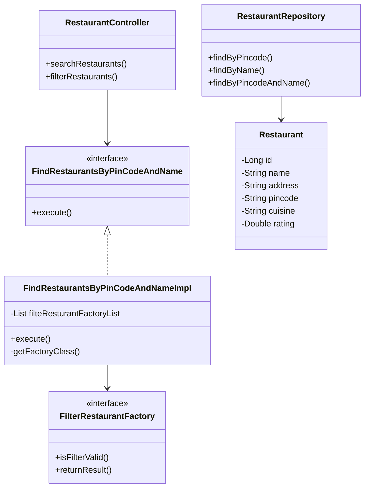

# Restaurant Management System

## System Design Overview

This is a restaurant management system that allows users to search and filter restaurants based on various criteria like pincode and name. The system follows a clean architecture pattern with clear separation of concerns.

### Architecture Components

1. **Controllers**: Handle HTTP requests and responses
2. **Services**: Contain business logic
3. **Repositories**: Handle data persistence
4. **Models**: Define data structures
5. **Factories**: Implement factory pattern for different filtering strategies

## Class Diagram



## API Endpoints

### 1. Search Restaurants

```http
GET /api/v1/restaurants/search
```

#### Query Parameters
- `pincode` (optional): Filter by pincode
- `name` (optional): Filter by restaurant name
- `cuisine` (optional): Filter by cuisine type
- `rating` (optional): Filter by minimum rating

#### Response
```json
{
    "restaurants": [
        {
            "id": 1,
            "name": "Restaurant Name",
            "address": "Restaurant Address",
            "pincode": "123456",
            "cuisine": "Italian",
            "rating": 4.5
        }
    ],
    "totalCount": 1
}
```

### 2. Filter Restaurants

```http
POST /api/v1/restaurants/filter
```

#### Request Body
```json
{
    "pincode": "123456",
    "name": "Restaurant Name",
    "cuisine": "Italian",
    "minRating": 4.0
}
```

#### Response
```json
{
    "restaurants": [
        {
            "id": 1,
            "name": "Restaurant Name",
            "address": "Restaurant Address",
            "pincode": "123456",
            "cuisine": "Italian",
            "rating": 4.5
        }
    ],
    "totalCount": 1
}
```

## Technology Stack

- Java 21
- Spring Boot 3.5.0
- Spring Data JPA
- PostgreSQL
- Lombok
- SpringDoc OpenAPI (Swagger)
- JUnit 5 & Mockito for testing

## Getting Started

1. Clone the repository
2. Configure PostgreSQL database in `application.properties`
3. Run the application:
```bash
mvn spring-boot:run
```
4. Access Swagger UI at: `http://localhost:8080/swagger-ui.html`

## Design Patterns Used

1. **Factory Pattern**: Used for creating different types of restaurant filters
2. **Strategy Pattern**: Implemented through different filtering strategies
3. **Repository Pattern**: For data access abstraction
4. **Dependency Injection**: Used throughout the application

## Future Enhancements

1. Add authentication and authorization
2. Implement caching for frequently accessed data
3. Add support for restaurant reviews and ratings
4. Implement restaurant reservation system
5. Add support for multiple cuisines per restaurant 